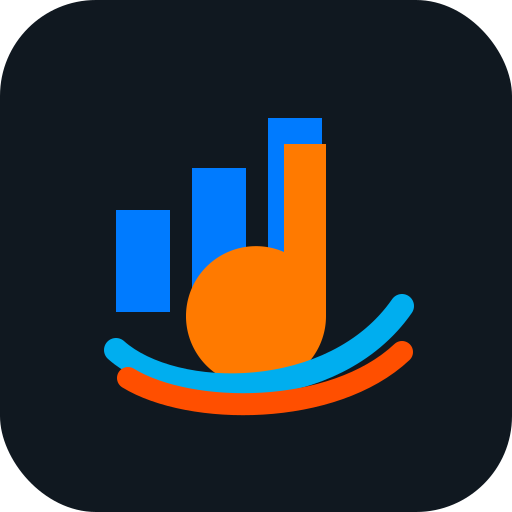

# Briefing completo para desenvolvimento — ReperTone

## 1. Nome do projeto

**ReperTone**

## 2. Slogan

**Seu repertório no tom certo.**

## 3. Conceito do produto

O **ReperTone** é uma plataforma web responsiva, com comportamento de aplicativo, voltada para criação, organização, compartilhamento e acompanhamento de repertórios musicais.

A solução deverá permitir que cantores, músicos, bandas, ministérios de música, igrejas, grupos de louvor, equipes de eventos e coordenadores musicais criem repertórios por evento, definam a ordem das músicas, informem o cantor responsável, registrem o tom escolhido para execução, vinculem cifras externas, anexem cifras próprias e disponibilizem tudo para a equipe acompanhar pelo celular, tablet ou computador.

O foco principal do produto é resolver uma dor prática: evitar repertórios espalhados em grupos de WhatsApp, links perdidos, cifras em tons errados, arquivos duplicados e falta de organização no momento do ensaio ou evento.

## 4. Objetivo do sistema

Criar uma aplicação simples, moderna, profissional e comercialmente viável para organizar repertórios musicais com:

- Nome da música;
- Ordem de execução;
- Cantor responsável;
- Tom original;
- Tom escolhido pelo cantor;
- Link externo da cifra;
- Arquivo próprio da cifra;
- Letra ou cifra digitada;
- Áudio guia;
- Vídeo de referência;
- Observações gerais;
- Observações por instrumento;
- Compartilhamento por link ou QR Code;
- Modo palco para uso ao vivo;
- Acesso offline para celular e tablet.

## 5. Público-alvo

O ReperTone deverá atender:

- Cantores;
- Músicos;
- Bandas;
- Ministérios de música;
- Igrejas;
- Grupos de louvor;
- Escolas de música;
- Produtores musicais;
- Coordenadores musicais;
- Equipes de eventos;
- Pequenos grupos musicais independentes;
- Casas de show;
- Músicos profissionais e amadores.

## 6. Problema que o produto resolve

Muitos grupos musicais ainda organizam seus repertórios usando mensagens soltas de WhatsApp, prints, PDFs, links avulsos, áudios separados e anotações manuais.

Isso gera problemas como:

- Músico tocando em tom errado;
- Cantor alterando o tom sem a equipe saber;
- Link de cifra perdido no grupo;
- Falta de ordem clara das músicas;
- Dificuldade para acessar o repertório no celular ou tablet;
- Arquivos autorais espalhados;
- Falta de controle de versão;
- Dificuldade para saber qual é a próxima música;
- Falta de material centralizado para ensaio;
- Confusão entre cifra original e tom escolhido para o evento.

O ReperTone deverá centralizar todas essas informações em uma experiência única, prática e acessível.

## 7. Proposta de valor

O ReperTone deverá ser apresentado comercialmente como:

> Uma plataforma para montar, organizar e compartilhar repertórios musicais com cifras, arquivos próprios e o tom escolhido pelo cantor, permitindo que músicos acompanhem tudo pelo celular ou tablet durante ensaios e apresentações.

## 8. Identidade visual

A identidade visual deverá ser baseada na logomarca criada para o ReperTone.

### 8.1 Direção visual

A marca deve transmitir:

- Música;
- Organização;
- Tecnologia;
- Energia;
- Palco;
- Segurança;
- Modernidade;
- Praticidade;
- Profissionalismo.

### 8.2 Elementos visuais da logo

A logomarca possui os seguintes conceitos visuais:

- Ícone musical com nota;
- Barras que remetem a equalizador ou intensidade sonora;
- Sensação de movimento;
- Uso de tons azuis e laranja;
- Nome “ReperTone” com destaque visual entre “Reper” e “Tone”;
- Slogan “Seu repertório no tom certo.”

### 8.3 Paleta de cores sugerida

Usar a logo como referência principal.

Cores principais:

- Azul principal: `#007BFF`
- Azul escuro: `#0057B8`
- Azul claro: `#00AEEF`
- Laranja principal: `#FF7A00`
- Laranja quente: `#FF4F00`
- Fundo escuro: `#101820`
- Cinza grafite: `#1F2933`
- Cinza claro: `#E5E7EB`
- Branco: `#FFFFFF`

### 8.4 Aplicação das cores

- Usar azul para menus, títulos, links e áreas de navegação.
- Usar laranja para chamadas de ação, botões principais, destaques de tom e alertas importantes.
- Usar fundo escuro no Modo Palco.
- Usar branco e cinza claro para telas de cadastro, leitura e formulários.
- Usar gradiente azul-laranja em áreas de destaque, tela inicial e botões promocionais.

### 8.5 Tipografia

Sugestão de fontes:

- Títulos: **Montserrat**, **Poppins** ou **Inter**;
- Textos: **Inter**, **Roboto** ou **Open Sans**;
- Números/tom musical: fonte forte e legível, como **Inter Bold** ou **Montserrat Bold**.

A interface deverá ser clara, com fonte grande o suficiente para leitura em celular e tablet.

### 8.6 Estilo dos componentes

Botões:

- Botão principal: fundo laranja, texto branco, cantos arredondados.
- Botão secundário: fundo azul, texto branco.
- Botão neutro: fundo branco, borda cinza, texto grafite.
- Botão de perigo: vermelho apenas para exclusão.

Cards:

- Usar cards com bordas arredondadas.
- Sombra leve.
- Destaque visual para o tom da música.
- Ícones para cifra, áudio, vídeo, arquivo e observações.

Modo Palco:

- Fundo escuro.
- Texto claro.
- Tom escolhido em laranja.
- Nome da música em branco ou azul claro.
- Botões grandes.
- Alto contraste.
- Poucos elementos visuais para evitar distração.

### 8.7 Ícones sugeridos

Usar ícones simples e modernos para:

- Música;
- Microfone;
- Violão;
- Baixo;
- Teclado;
- Bateria;
- Cifra;
- PDF;
- Link externo;
- Upload;
- Download;
- QR Code;
- Compartilhar;
- Modo palco;
- Offline;
- Próxima música;
- Música anterior.

## 9. Estrutura geral do sistema

A aplicação deverá possuir os seguintes módulos:

1. Login e autenticação;
2. Dashboard;
3. Equipes musicais;
4. Eventos;
5. Repertórios;
6. Biblioteca de músicas;
7. Busca de cifra;
8. Upload de cifra própria;
9. Compartilhamento;
10. Modo palco;
11. Acesso offline;
12. Histórico de alterações;
13. Configurações;
14. Planos e assinatura, em versão futura.

## 10. Requisitos funcionais

### RF001 — Login

O sistema deverá permitir login de usuários com e-mail e senha.

Também deverá ser prevista estrutura futura para login social, como Google ou Apple.

### RF002 — Cadastro de usuário

O sistema deverá permitir cadastrar usuário com:

- Nome;
- E-mail;
- Senha;
- Telefone, opcional;
- Foto, opcional;
- Instrumento ou função musical;
- Perfil de acesso.

### RF003 — Dashboard

Após o login, o usuário deverá visualizar um dashboard com:

- Próximos eventos;
- Repertórios recentes;
- Músicas mais utilizadas;
- Atalhos rápidos;
- Botão para criar novo evento;
- Botão para criar nova música;
- Avisos de alterações recentes.

### RF004 — Cadastro de equipe

O sistema deverá permitir criar equipes musicais.

Campos da equipe:

- Nome da equipe;
- Descrição;
- Tipo de equipe;
- Logomarca, opcional;
- Integrantes;
- Responsável principal.

Exemplos de tipo:

- Banda;
- Ministério de música;
- Igreja;
- Grupo de louvor;
- Escola de música;
- Equipe de evento;
- Projeto pessoal.

### RF005 — Integrantes da equipe

O sistema deverá permitir adicionar integrantes à equipe.

Campos do integrante:

- Nome;
- E-mail;
- Telefone;
- Função;
- Instrumento;
- Perfil de acesso;
- Status: ativo ou inativo.

Funções sugeridas:

- Coordenador;
- Cantor;
- Vocal;
- Violão;
- Guitarra;
- Baixo;
- Teclado;
- Bateria;
- Percussão;
- Técnico de som;
- Convidado.

### RF006 — Cadastro de evento

O sistema deverá permitir criar eventos.

Campos do evento:

- Nome do evento;
- Tipo do evento;
- Data;
- Horário;
- Local;
- Descrição;
- Equipe responsável;
- Status do evento;
- Observações gerais.

Tipos de evento:

- Ensaio;
- Missa;
- Culto;
- Show;
- Apresentação;
- Retiro;
- Congresso;
- Reunião musical;
- Evento corporativo;
- Outro.

Status:

- Rascunho;
- Em preparação;
- Confirmado;
- Realizado;
- Cancelado.

### RF007 — Criação de repertório

Cada evento deverá possuir um repertório.

O usuário deverá conseguir adicionar músicas ao repertório, definir ordem e configurar os dados musicais.

### RF008 — Adicionar música ao repertório

Campos da música no repertório:

- Ordem;
- Nome da música;
- Artista, ministério ou autor;
- Tipo da música;
- Cantor principal;
- Tom original;
- Tom escolhido;
- Link externo da cifra;
- Arquivo anexado;
- Letra/cifra digitada;
- Áudio guia;
- Vídeo de referência;
- Observações gerais;
- Observações por instrumento;
- Status da música.

Tipos de música:

- Conhecida;
- Autoral;
- Adaptação;
- Instrumental;
- Outro.

Status da música:

- Pendente;
- Em ensaio;
- Ensaiada;
- Aprovada;
- Substituída;
- Removida.

### RF009 — Ordenação das músicas

O sistema deverá permitir alterar a ordem das músicas por arrastar e soltar.

Também deverá permitir alterar manualmente o número da ordem.

### RF010 — Tom escolhido pelo cantor

O sistema deverá permitir informar o tom escolhido pelo cantor.

O tom escolhido deverá ser exibido com destaque em todas as telas do repertório e no Modo Palco.

Tons aceitos:

- C
- C#
- Db
- D
- D#
- Eb
- E
- F
- F#
- Gb
- G
- G#
- Ab
- A
- A#
- Bb
- B

Também deverá permitir modo menor:

- Am
- Bm
- Cm
- Dm
- Em
- Fm
- Gm

E variações com sustenido/bemol quando necessário.

### RF011 — Link externo da cifra

O sistema deverá permitir cadastrar link externo de cifra.

Exemplos de fontes:

- Cifra Club;
- ToqueFácil;
- YouTube, como referência;
- Google Drive;
- Site próprio;
- Outro link informado pelo usuário.

O sistema deverá salvar somente o link da cifra externa, sem copiar automaticamente o conteúdo completo de letras ou cifras de sites terceiros.

### RF012 — Buscar cifra

O sistema deverá ter um botão “Buscar cifra”.

Fluxo:

1. Usuário informa nome da música.
2. Usuário informa artista, banda ou ministério.
3. Sistema executa busca por links relacionados.
4. Sistema exibe possíveis resultados.
5. Usuário seleciona o resultado correto.
6. Link é salvo na música.

A busca deve ser configurável e não deve depender obrigatoriamente de um único provedor.

### RF013 — Cifra própria / música autoral

Quando a música não estiver em sites externos, o sistema deverá permitir cadastrar cifra própria.

Opções:

- Upload de PDF;
- Upload de imagem;
- Upload de DOC/DOCX;
- Upload de TXT;
- Digitação direta da letra/cifra;
- Upload de áudio guia;
- Upload de vídeo de referência;
- Upload de partitura.

O sistema deverá gerar um link interno seguro para acesso da equipe.

### RF014 — Visualização da música

A tela de visualização da música deverá exibir:

- Nome;
- Artista/autor;
- Cantor;
- Tom original;
- Tom escolhido;
- Botão para abrir cifra externa;
- Botão para abrir arquivo interno;
- Botão para tocar áudio guia;
- Botão para abrir vídeo;
- Observações;
- Histórico de alterações.

### RF015 — Observações gerais

O sistema deverá permitir adicionar observações gerais da música.

Exemplos:

- “Começar somente voz e teclado.”
- “Repetir o refrão duas vezes.”
- “Baixo entra na segunda parte.”
- “Finalizar segurando em A.”
- “Subir meio tom no último refrão.”

### RF016 — Observações por instrumento

O sistema deverá permitir observações específicas por função ou instrumento.

Instrumentos/funções:

- Vocal;
- Violão;
- Guitarra;
- Baixo;
- Teclado;
- Bateria;
- Percussão;
- Técnico de som;
- Outro.

### RF017 — Compartilhamento

O sistema deverá permitir compartilhar o repertório com a equipe por:

- Link compartilhável;
- QR Code;
- E-mail;
- WhatsApp;
- Convite por login.

O link poderá ser:

- Público com acesso restrito por token;
- Privado, exigindo login;
- Temporário, com data de expiração;
- Somente leitura.

### RF018 — Tela do músico

O músico deverá ter uma tela prática para acessar pelo celular ou tablet.

Essa tela deverá conter:

- Nome do evento;
- Data e horário;
- Local;
- Lista das músicas em ordem;
- Tom de cada música;
- Cantor responsável;
- Botão para cifra;
- Botão para arquivo;
- Botão para áudio;
- Observações;
- Indicação visual de alteração recente.

### RF019 — Modo Palco

O Modo Palco é uma das funcionalidades centrais do produto.

Ele deverá ser otimizado para uso ao vivo em celular e tablet.

Requisitos:

- Exibir uma música por vez;
- Exibir nome da música em destaque;
- Exibir tom escolhido em destaque;
- Exibir cantor principal;
- Exibir cifra, letra ou arquivo;
- Permitir avançar para próxima música;
- Permitir voltar para música anterior;
- Exibir a próxima música no rodapé;
- Ter modo escuro;
- Permitir aumentar ou diminuir fonte;
- Permitir rolagem automática;
- Manter tela ativa;
- Ter botões grandes;
- Ter alto contraste;
- Funcionar offline quando o repertório tiver sido baixado.

### RF020 — Download offline

O sistema deverá permitir baixar o repertório para uso offline.

O offline deverá incluir:

- Lista de músicas;
- Ordem;
- Tons escolhidos;
- Cantores;
- Observações;
- Arquivos internos;
- Letras/cifras digitadas;
- PDFs;
- Imagens;
- Áudios guia, se possível;
- Dados necessários para o Modo Palco.

Caso haja alteração depois do download, o sistema deverá informar que existe uma versão mais recente disponível.

### RF021 — Histórico de alterações

O sistema deverá registrar alterações importantes:

- Música adicionada;
- Música removida;
- Ordem alterada;
- Tom alterado;
- Cantor alterado;
- Link alterado;
- Arquivo substituído;
- Observação alterada;
- Status alterado;
- Repertório compartilhado.

Cada registro deverá conter:

- Usuário;
- Data;
- Hora;
- Tipo de alteração;
- Valor anterior;
- Novo valor.

### RF022 — Notificações

O sistema deverá prever notificações internas para alterações importantes.

Exemplos:

- “O tom da música X foi alterado.”
- “Uma nova música foi adicionada.”
- “A ordem do repertório foi alterada.”
- “O arquivo da cifra foi substituído.”
- “O repertório foi confirmado.”

### RF023 — Biblioteca de músicas

O sistema deverá possuir uma biblioteca para reaproveitamento de músicas.

Campos:

- Nome;
- Artista;
- Autor;
- Tom original;
- Links de cifra;
- Arquivos próprios;
- Observações;
- Tons já utilizados;
- Histórico de uso;
- Eventos vinculados.

### RF024 — Reutilização de repertório

O sistema deverá permitir duplicar repertórios de eventos anteriores.

Exemplo:

- Duplicar repertório da missa passada;
- Alterar apenas ordem, tom ou cantor;
- Salvar como novo evento.

### RF025 — Controle de permissões

Perfis sugeridos:

Administrador:

- Acesso completo.

Coordenador:

- Cria eventos;
- Cria repertórios;
- Edita músicas;
- Compartilha com a equipe.

Músico:

- Visualiza repertórios;
- Acessa cifra;
- Acessa arquivos;
- Usa Modo Palco.

Convidado:

- Acesso somente leitura por link ou QR Code.

### RF026 — Personalização para planos futuros

Em planos pagos, prever:

- Logo da equipe;
- Nome da igreja/banda;
- Cores personalizadas;
- Múltiplas equipes;
- Relatórios;
- Assinatura;
- Gestão avançada de usuários.

## 11. Requisitos não funcionais

### RNF001 — Responsividade

A aplicação deverá ser totalmente responsiva, funcionando bem em:

- Celular;
- Tablet;
- Notebook;
- Computador desktop.

### RNF002 — PWA

A aplicação deverá ser desenvolvida como PWA sempre que possível, permitindo:

- Instalação na tela inicial;
- Cache de repertórios;
- Modo offline;
- Experiência parecida com aplicativo.

### RNF003 — Performance

As telas do repertório e do Modo Palco devem ser rápidas, leves e confiáveis.

### RNF004 — Segurança

Os arquivos enviados pelos usuários deverão ser armazenados de forma segura.

O acesso a arquivos internos deve respeitar permissões da equipe e do evento.

### RNF005 — LGPD e privacidade

O sistema deverá respeitar boas práticas de privacidade, permitindo controle sobre dados pessoais, arquivos e links compartilhados.

### RNF006 — Usabilidade

A interface deverá priorizar facilidade de uso.

O coordenador deve conseguir montar um repertório em poucos minutos.

O músico deve conseguir abrir e acompanhar o repertório sem treinamento complexo.

### RNF007 — Escalabilidade

A estrutura deverá permitir crescimento futuro para múltiplas equipes, planos pagos, usuários simultâneos e armazenamento de arquivos.

## 12. Telas sugeridas

### 12.1 Tela de login

Elementos:

- Logo ReperTone;
- Slogan;
- Campo de e-mail;
- Campo de senha;
- Botão Entrar;
- Link Criar conta;
- Link Esqueci minha senha.

### 12.2 Dashboard

Elementos:

- Saudação ao usuário;
- Próximos eventos;
- Repertórios recentes;
- Botão Novo Evento;
- Botão Nova Música;
- Atalhos para equipes;
- Cards com estatísticas simples.

### 12.3 Tela de equipes

Elementos:

- Lista de equipes;
- Criar equipe;
- Editar equipe;
- Integrantes;
- Funções;
- Permissões.

### 12.4 Tela de eventos

Elementos:

- Lista de eventos;
- Filtros por data e status;
- Botão criar evento;
- Acesso ao repertório;
- Compartilhamento.

### 12.5 Tela de montagem do repertório

Essa tela deverá ser o centro operacional do sistema.

Elementos:

- Dados do evento;
- Lista ordenável de músicas;
- Botão adicionar música;
- Botão buscar cifra;
- Botão anexar cifra;
- Campo de tom escolhido;
- Campo cantor;
- Observações;
- Status da música;
- Botão compartilhar;
- Botão abrir Modo Palco.

### 12.6 Tela de cadastro da música

Elementos:

- Nome da música;
- Artista/autor;
- Tipo;
- Tom original;
- Link externo;
- Upload de arquivo;
- Letra/cifra digitada;
- Áudio guia;
- Vídeo de referência;
- Observações.

### 12.7 Tela de busca de cifra

Elementos:

- Campo nome da música;
- Campo artista;
- Botão pesquisar;
- Lista de resultados;
- Nome encontrado;
- Fonte;
- Link;
- Botão selecionar.

### 12.8 Tela do músico

Elementos:

- Nome do evento;
- Data;
- Lista de músicas;
- Tom em destaque;
- Cantor;
- Botão cifra;
- Botão arquivo;
- Botão áudio;
- Observações.

### 12.9 Modo Palco

Elementos:

- Nome da música;
- Tom escolhido grande;
- Cantor;
- Conteúdo da cifra ou arquivo;
- Botão anterior;
- Botão próxima;
- Próxima música;
- Controle de fonte;
- Rolagem automática;
- Modo escuro;
- Indicador offline.

### 12.10 Configurações

Elementos:

- Perfil do usuário;
- Preferências visuais;
- Modo escuro;
- Tamanho padrão da fonte;
- Dados da equipe;
- Plano/assinatura em versão futura.

## 13. Modelo de dados sugerido

### users

- id
- name
- email
- password_hash
- phone
- avatar_url
- default_role
- created_at
- updated_at

### teams

- id
- name
- description
- type
- logo_url
- owner_user_id
- created_at
- updated_at

### team_members

- id
- team_id
- user_id
- role
- instrument
- status
- created_at
- updated_at

### events

- id
- team_id
- name
- type
- event_date
- start_time
- end_time
- location
- description
- status
- created_by
- created_at
- updated_at

### songs

- id
- title
- artist
- author
- type
- original_key
- external_url
- notes
- created_by
- created_at
- updated_at

### song_files

- id
- song_id
- file_type
- file_name
- file_url
- uploaded_by
- created_at

### repertoires

- id
- event_id
- name
- status
- created_by
- created_at
- updated_at

### repertoire_items

- id
- repertoire_id
- song_id
- position
- singer_name
- original_key
- selected_key
- external_chord_url
- internal_file_id
- guide_audio_url
- guide_video_url
- general_notes
- status
- created_at
- updated_at

### instrument_notes

- id
- repertoire_item_id
- instrument
- note
- created_by
- created_at
- updated_at

### share_links

- id
- repertoire_id
- token
- access_type
- expires_at
- created_by
- created_at

### change_logs

- id
- entity_type
- entity_id
- action
- old_value
- new_value
- user_id
- created_at

## 14. Experiência do usuário

### Coordenador musical

Fluxo ideal:

1. Faz login.
2. Cria equipe.
3. Cria evento.
4. Adiciona músicas.
5. Define ordem.
6. Informa cantor e tom.
7. Cola link da cifra ou anexa arquivo.
8. Compartilha com músicos.
9. Acompanha alterações.

### Músico

Fluxo ideal:

1. Recebe link ou QR Code.
2. Abre no celular ou tablet.
3. Visualiza repertório.
4. Baixa para offline, se necessário.
5. Abre Modo Palco.
6. Acompanha música por música durante o evento.

## 15. Cuidados jurídicos e de conteúdo

O sistema não deverá copiar automaticamente letras ou cifras completas de sites externos.

O sistema deverá permitir:

- Salvar link externo informado ou escolhido pelo usuário;
- Anexar arquivos próprios do usuário;
- Digitar conteúdo próprio;
- Organizar material musical sem reproduzir conteúdo protegido indevidamente.

Para músicas autorais, o arquivo enviado deverá ser de responsabilidade do usuário que realizou o upload.

## 16. MVP recomendado

A primeira versão deve conter:

- Login;
- Dashboard;
- Cadastro de equipe;
- Cadastro de evento;
- Montagem de repertório;
- Cadastro de música;
- Campo de tom escolhido;
- Link externo da cifra;
- Upload de arquivo próprio;
- Compartilhamento por link;
- Tela do músico;
- Modo Palco;
- Layout responsivo;
- Identidade visual ReperTone.

Funcionalidades para fases futuras:

- Busca automática de cifra;
- QR Code;
- Offline avançado;
- Áudio guia;
- Vídeo guia;
- Notificações;
- Observações por instrumento;
- Histórico completo;
- Planos pagos;
- App nativo Android/iOS.

## 17. Direcionamento para implementação

Desenvolver uma aplicação web moderna, responsiva e com aparência de aplicativo.

Priorizar:

- Interface limpa;
- Uso simples;
- Botões grandes;
- Leitura fácil;
- Modo palco altamente funcional;
- Experiência mobile-first;
- Componentização;
- Preparação para PWA;
- Estrutura escalável para SaaS.

## 18. Texto comercial curto

**ReperTone — Seu repertório no tom certo.**

Monte repertórios, defina o tom ideal para cada cantor, compartilhe cifras, anexe arquivos próprios e acompanhe tudo em modo palco pelo celular ou tablet.

## 19. Prompt resumido para o CODEX

Crie uma aplicação web responsiva chamada **ReperTone**, com base na logomarca fornecida, usando identidade visual em azul, laranja, branco e fundo escuro para o Modo Palco.

A aplicação deverá permitir montar repertórios musicais por evento, cadastrar músicas, definir ordem de execução, informar cantor responsável, tom original, tom escolhido, link externo da cifra, arquivo próprio anexado, observações gerais e observações por instrumento.

O sistema deverá ter telas de login, dashboard, equipes, eventos, montagem de repertório, cadastro de música, visualização do músico e Modo Palco.

O Modo Palco deverá ser otimizado para celular e tablet, exibindo uma música por vez, tom escolhido em destaque, botões grandes de próxima/anterior, opção de modo escuro, controle de fonte, visualização de cifra/arquivo e indicação da próxima música.

O sistema deverá permitir compartilhar repertórios por link e futuramente por QR Code. Também deverá prever estrutura para acesso offline, histórico de alterações, upload de arquivos próprios e busca automática de links de cifras externas.

Não copiar automaticamente letras ou cifras de sites externos. O sistema deve apenas armazenar links externos ou arquivos enviados pelo próprio usuário.

A interface deve ser moderna, musical, intuitiva, mobile-first e com identidade visual profissional baseada na marca **ReperTone**.
# Briefing completo para desenvolvimento — ReperTone

## 1. Nome do projeto

**ReperTone**

## 2. Slogan

**Seu repertório no tom certo.**

## 3. Conceito do produto

O **ReperTone** é uma plataforma web responsiva, com comportamento de aplicativo, voltada para criação, organização, compartilhamento e acompanhamento de repertórios musicais.

A solução deverá permitir que cantores, músicos, bandas, ministérios de música, igrejas, grupos de louvor, equipes de eventos e coordenadores musicais criem repertórios por evento, definam a ordem das músicas, informem o cantor responsável, registrem o tom escolhido para execução, vinculem cifras externas, anexem cifras próprias e disponibilizem tudo para a equipe acompanhar pelo celular, tablet ou computador.

O foco principal do produto é resolver uma dor prática: evitar repertórios espalhados em grupos de WhatsApp, links perdidos, cifras em tons errados, arquivos duplicados e falta de organização no momento do ensaio ou evento.

## 4. Objetivo do sistema

Criar uma aplicação simples, moderna, profissional e comercialmente viável para organizar repertórios musicais com:

- Nome da música;
- Ordem de execução;
- Cantor responsável;
- Tom original;
- Tom escolhido pelo cantor;
- Link externo da cifra;
- Arquivo próprio da cifra;
- Letra ou cifra digitada;
- Áudio guia;
- Vídeo de referência;
- Observações gerais;
- Observações por instrumento;
- Compartilhamento por link ou QR Code;
- Modo palco para uso ao vivo;
- Acesso offline para celular e tablet.

## 5. Público-alvo

O ReperTone deverá atender:

- Cantores;
- Músicos;
- Bandas;
- Ministérios de música;
- Igrejas;
- Grupos de louvor;
- Escolas de música;
- Produtores musicais;
- Coordenadores musicais;
- Equipes de eventos;
- Pequenos grupos musicais independentes;
- Casas de show;
- Músicos profissionais e amadores.

## 6. Problema que o produto resolve

Muitos grupos musicais ainda organizam seus repertórios usando mensagens soltas de WhatsApp, prints, PDFs, links avulsos, áudios separados e anotações manuais.

Isso gera problemas como:

- Músico tocando em tom errado;
- Cantor alterando o tom sem a equipe saber;
- Link de cifra perdido no grupo;
- Falta de ordem clara das músicas;
- Dificuldade para acessar o repertório no celular ou tablet;
- Arquivos autorais espalhados;
- Falta de controle de versão;
- Dificuldade para saber qual é a próxima música;
- Falta de material centralizado para ensaio;
- Confusão entre cifra original e tom escolhido para o evento.

O ReperTone deverá centralizar todas essas informações em uma experiência única, prática e acessível.

## 7. Proposta de valor

O ReperTone deverá ser apresentado comercialmente como:

> Uma plataforma para montar, organizar e compartilhar repertórios musicais com cifras, arquivos próprios e o tom escolhido pelo cantor, permitindo que músicos acompanhem tudo pelo celular ou tablet durante ensaios e apresentações.

## 8. Identidade visual

A identidade visual deverá ser baseada na logomarca criada para o ReperTone.

### 8.1 Direção visual

A marca deve transmitir:

- Música;
- Organização;
- Tecnologia;
- Energia;
- Palco;
- Segurança;
- Modernidade;
- Praticidade;
- Profissionalismo.

### 8.2 Elementos visuais da logo

A logomarca possui os seguintes conceitos visuais:

- Ícone musical com nota;
- Barras que remetem a equalizador ou intensidade sonora;
- Sensação de movimento;
- Uso de tons azuis e laranja;
- Nome “ReperTone” com destaque visual entre “Reper” e “Tone”;
- Slogan “Seu repertório no tom certo.”

### 8.3 Paleta de cores sugerida

Usar a logo como referência principal.

Cores principais:

- Azul principal: `#007BFF`
- Azul escuro: `#0057B8`
- Azul claro: `#00AEEF`
- Laranja principal: `#FF7A00`
- Laranja quente: `#FF4F00`
- Fundo escuro: `#101820`
- Cinza grafite: `#1F2933`
- Cinza claro: `#E5E7EB`
- Branco: `#FFFFFF`

### 8.4 Aplicação das cores

- Usar azul para menus, títulos, links e áreas de navegação.
- Usar laranja para chamadas de ação, botões principais, destaques de tom e alertas importantes.
- Usar fundo escuro no Modo Palco.
- Usar branco e cinza claro para telas de cadastro, leitura e formulários.
- Usar gradiente azul-laranja em áreas de destaque, tela inicial e botões promocionais.

### 8.5 Tipografia

Sugestão de fontes:

- Títulos: **Montserrat**, **Poppins** ou **Inter**;
- Textos: **Inter**, **Roboto** ou **Open Sans**;
- Números/tom musical: fonte forte e legível, como **Inter Bold** ou **Montserrat Bold**.

A interface deverá ser clara, com fonte grande o suficiente para leitura em celular e tablet.

### 8.6 Estilo dos componentes

Botões:

- Botão principal: fundo laranja, texto branco, cantos arredondados.
- Botão secundário: fundo azul, texto branco.
- Botão neutro: fundo branco, borda cinza, texto grafite.
- Botão de perigo: vermelho apenas para exclusão.

Cards:

- Usar cards com bordas arredondadas.
- Sombra leve.
- Destaque visual para o tom da música.
- Ícones para cifra, áudio, vídeo, arquivo e observações.

Modo Palco:

- Fundo escuro.
- Texto claro.
- Tom escolhido em laranja.
- Nome da música em branco ou azul claro.
- Botões grandes.
- Alto contraste.
- Poucos elementos visuais para evitar distração.

### 8.7 Ícones sugeridos

Usar ícones simples e modernos para:

- Música;
- Microfone;
- Violão;
- Baixo;
- Teclado;
- Bateria;
- Cifra;
- PDF;
- Link externo;
- Upload;
- Download;
- QR Code;
- Compartilhar;
- Modo palco;
- Offline;
- Próxima música;
- Música anterior.

## 9. Estrutura geral do sistema

A aplicação deverá possuir os seguintes módulos:

1. Login e autenticação;
2. Dashboard;
3. Equipes musicais;
4. Eventos;
5. Repertórios;
6. Biblioteca de músicas;
7. Busca de cifra;
8. Upload de cifra própria;
9. Compartilhamento;
10. Modo palco;
11. Acesso offline;
12. Histórico de alterações;
13. Configurações;
14. Planos e assinatura, em versão futura.

## 10. Requisitos funcionais

### RF001 — Login

O sistema deverá permitir login de usuários com e-mail e senha.

Também deverá ser prevista estrutura futura para login social, como Google ou Apple.

### RF002 — Cadastro de usuário

O sistema deverá permitir cadastrar usuário com:

- Nome;
- E-mail;
- Senha;
- Telefone, opcional;
- Foto, opcional;
- Instrumento ou função musical;
- Perfil de acesso.

### RF003 — Dashboard

Após o login, o usuário deverá visualizar um dashboard com:

- Próximos eventos;
- Repertórios recentes;
- Músicas mais utilizadas;
- Atalhos rápidos;
- Botão para criar novo evento;
- Botão para criar nova música;
- Avisos de alterações recentes.

### RF004 — Cadastro de equipe

O sistema deverá permitir criar equipes musicais.

Campos da equipe:

- Nome da equipe;
- Descrição;
- Tipo de equipe;
- Logomarca, opcional;
- Integrantes;
- Responsável principal.

Exemplos de tipo:

- Banda;
- Ministério de música;
- Igreja;
- Grupo de louvor;
- Escola de música;
- Equipe de evento;
- Projeto pessoal.

### RF005 — Integrantes da equipe

O sistema deverá permitir adicionar integrantes à equipe.

Campos do integrante:

- Nome;
- E-mail;
- Telefone;
- Função;
- Instrumento;
- Perfil de acesso;
- Status: ativo ou inativo.

Funções sugeridas:

- Coordenador;
- Cantor;
- Vocal;
- Violão;
- Guitarra;
- Baixo;
- Teclado;
- Bateria;
- Percussão;
- Técnico de som;
- Convidado.

### RF006 — Cadastro de evento

O sistema deverá permitir criar eventos.

Campos do evento:

- Nome do evento;
- Tipo do evento;
- Data;
- Horário;
- Local;
- Descrição;
- Equipe responsável;
- Status do evento;
- Observações gerais.

Tipos de evento:

- Ensaio;
- Missa;
- Culto;
- Show;
- Apresentação;
- Retiro;
- Congresso;
- Reunião musical;
- Evento corporativo;
- Outro.

Status:

- Rascunho;
- Em preparação;
- Confirmado;
- Realizado;
- Cancelado.

### RF007 — Criação de repertório

Cada evento deverá possuir um repertório.

O usuário deverá conseguir adicionar músicas ao repertório, definir ordem e configurar os dados musicais.

### RF008 — Adicionar música ao repertório

Campos da música no repertório:

- Ordem;
- Nome da música;
- Artista, ministério ou autor;
- Tipo da música;
- Cantor principal;
- Tom original;
- Tom escolhido;
- Link externo da cifra;
- Arquivo anexado;
- Letra/cifra digitada;
- Áudio guia;
- Vídeo de referência;
- Observações gerais;
- Observações por instrumento;
- Status da música.

Tipos de música:

- Conhecida;
- Autoral;
- Adaptação;
- Instrumental;
- Outro.

Status da música:

- Pendente;
- Em ensaio;
- Ensaiada;
- Aprovada;
- Substituída;
- Removida.

### RF009 — Ordenação das músicas

O sistema deverá permitir alterar a ordem das músicas por arrastar e soltar.

Também deverá permitir alterar manualmente o número da ordem.

### RF010 — Tom escolhido pelo cantor

O sistema deverá permitir informar o tom escolhido pelo cantor.

O tom escolhido deverá ser exibido com destaque em todas as telas do repertório e no Modo Palco.

Tons aceitos:

- C
- C#
- Db
- D
- D#
- Eb
- E
- F
- F#
- Gb
- G
- G#
- Ab
- A
- A#
- Bb
- B

Também deverá permitir modo menor:

- Am
- Bm
- Cm
- Dm
- Em
- Fm
- Gm

E variações com sustenido/bemol quando necessário.

### RF011 — Link externo da cifra

O sistema deverá permitir cadastrar link externo de cifra.

Exemplos de fontes:

- Cifra Club;
- ToqueFácil;
- YouTube, como referência;
- Google Drive;
- Site próprio;
- Outro link informado pelo usuário.

O sistema deverá salvar somente o link da cifra externa, sem copiar automaticamente o conteúdo completo de letras ou cifras de sites terceiros.

### RF012 — Buscar cifra

O sistema deverá ter um botão “Buscar cifra”.

Fluxo:

1. Usuário informa nome da música.
2. Usuário informa artista, banda ou ministério.
3. Sistema executa busca por links relacionados.
4. Sistema exibe possíveis resultados.
5. Usuário seleciona o resultado correto.
6. Link é salvo na música.

A busca deve ser configurável e não deve depender obrigatoriamente de um único provedor.

### RF013 — Cifra própria / música autoral

Quando a música não estiver em sites externos, o sistema deverá permitir cadastrar cifra própria.

Opções:

- Upload de PDF;
- Upload de imagem;
- Upload de DOC/DOCX;
- Upload de TXT;
- Digitação direta da letra/cifra;
- Upload de áudio guia;
- Upload de vídeo de referência;
- Upload de partitura.

O sistema deverá gerar um link interno seguro para acesso da equipe.

### RF014 — Visualização da música

A tela de visualização da música deverá exibir:

- Nome;
- Artista/autor;
- Cantor;
- Tom original;
- Tom escolhido;
- Botão para abrir cifra externa;
- Botão para abrir arquivo interno;
- Botão para tocar áudio guia;
- Botão para abrir vídeo;
- Observações;
- Histórico de alterações.

### RF015 — Observações gerais

O sistema deverá permitir adicionar observações gerais da música.

Exemplos:

- “Começar somente voz e teclado.”
- “Repetir o refrão duas vezes.”
- “Baixo entra na segunda parte.”
- “Finalizar segurando em A.”
- “Subir meio tom no último refrão.”

### RF016 — Observações por instrumento

O sistema deverá permitir observações específicas por função ou instrumento.

Instrumentos/funções:

- Vocal;
- Violão;
- Guitarra;
- Baixo;
- Teclado;
- Bateria;
- Percussão;
- Técnico de som;
- Outro.

### RF017 — Compartilhamento

O sistema deverá permitir compartilhar o repertório com a equipe por:

- Link compartilhável;
- QR Code;
- E-mail;
- WhatsApp;
- Convite por login.

O link poderá ser:

- Público com acesso restrito por token;
- Privado, exigindo login;
- Temporário, com data de expiração;
- Somente leitura.

### RF018 — Tela do músico

O músico deverá ter uma tela prática para acessar pelo celular ou tablet.

Essa tela deverá conter:

- Nome do evento;
- Data e horário;
- Local;
- Lista das músicas em ordem;
- Tom de cada música;
- Cantor responsável;
- Botão para cifra;
- Botão para arquivo;
- Botão para áudio;
- Observações;
- Indicação visual de alteração recente.

### RF019 — Modo Palco

O Modo Palco é uma das funcionalidades centrais do produto.

Ele deverá ser otimizado para uso ao vivo em celular e tablet.

Requisitos:

- Exibir uma música por vez;
- Exibir nome da música em destaque;
- Exibir tom escolhido em destaque;
- Exibir cantor principal;
- Exibir cifra, letra ou arquivo;
- Permitir avançar para próxima música;
- Permitir voltar para música anterior;
- Exibir a próxima música no rodapé;
- Ter modo escuro;
- Permitir aumentar ou diminuir fonte;
- Permitir rolagem automática;
- Manter tela ativa;
- Ter botões grandes;
- Ter alto contraste;
- Funcionar offline quando o repertório tiver sido baixado.

### RF020 — Download offline

O sistema deverá permitir baixar o repertório para uso offline.

O offline deverá incluir:

- Lista de músicas;
- Ordem;
- Tons escolhidos;
- Cantores;
- Observações;
- Arquivos internos;
- Letras/cifras digitadas;
- PDFs;
- Imagens;
- Áudios guia, se possível;
- Dados necessários para o Modo Palco.

Caso haja alteração depois do download, o sistema deverá informar que existe uma versão mais recente disponível.

### RF021 — Histórico de alterações

O sistema deverá registrar alterações importantes:

- Música adicionada;
- Música removida;
- Ordem alterada;
- Tom alterado;
- Cantor alterado;
- Link alterado;
- Arquivo substituído;
- Observação alterada;
- Status alterado;
- Repertório compartilhado.

Cada registro deverá conter:

- Usuário;
- Data;
- Hora;
- Tipo de alteração;
- Valor anterior;
- Novo valor.

### RF022 — Notificações

O sistema deverá prever notificações internas para alterações importantes.

Exemplos:

- “O tom da música X foi alterado.”
- “Uma nova música foi adicionada.”
- “A ordem do repertório foi alterada.”
- “O arquivo da cifra foi substituído.”
- “O repertório foi confirmado.”

### RF023 — Biblioteca de músicas

O sistema deverá possuir uma biblioteca para reaproveitamento de músicas.

Campos:

- Nome;
- Artista;
- Autor;
- Tom original;
- Links de cifra;
- Arquivos próprios;
- Observações;
- Tons já utilizados;
- Histórico de uso;
- Eventos vinculados.

### RF024 — Reutilização de repertório

O sistema deverá permitir duplicar repertórios de eventos anteriores.

Exemplo:

- Duplicar repertório da missa passada;
- Alterar apenas ordem, tom ou cantor;
- Salvar como novo evento.

### RF025 — Controle de permissões

Perfis sugeridos:

Administrador:

- Acesso completo.

Coordenador:

- Cria eventos;
- Cria repertórios;
- Edita músicas;
- Compartilha com a equipe.

Músico:

- Visualiza repertórios;
- Acessa cifra;
- Acessa arquivos;
- Usa Modo Palco.

Convidado:

- Acesso somente leitura por link ou QR Code.

### RF026 — Personalização para planos futuros

Em planos pagos, prever:

- Logo da equipe;
- Nome da igreja/banda;
- Cores personalizadas;
- Múltiplas equipes;
- Relatórios;
- Assinatura;
- Gestão avançada de usuários.

## 11. Requisitos não funcionais

### RNF001 — Responsividade

A aplicação deverá ser totalmente responsiva, funcionando bem em:

- Celular;
- Tablet;
- Notebook;
- Computador desktop.

### RNF002 — PWA

A aplicação deverá ser desenvolvida como PWA sempre que possível, permitindo:

- Instalação na tela inicial;
- Cache de repertórios;
- Modo offline;
- Experiência parecida com aplicativo.

### RNF003 — Performance

As telas do repertório e do Modo Palco devem ser rápidas, leves e confiáveis.

### RNF004 — Segurança

Os arquivos enviados pelos usuários deverão ser armazenados de forma segura.

O acesso a arquivos internos deve respeitar permissões da equipe e do evento.

### RNF005 — LGPD e privacidade

O sistema deverá respeitar boas práticas de privacidade, permitindo controle sobre dados pessoais, arquivos e links compartilhados.

### RNF006 — Usabilidade

A interface deverá priorizar facilidade de uso.

O coordenador deve conseguir montar um repertório em poucos minutos.

O músico deve conseguir abrir e acompanhar o repertório sem treinamento complexo.

### RNF007 — Escalabilidade

A estrutura deverá permitir crescimento futuro para múltiplas equipes, planos pagos, usuários simultâneos e armazenamento de arquivos.

## 12. Telas sugeridas

### 12.1 Tela de login

Elementos:

- Logo ReperTone;
- Slogan;
- Campo de e-mail;
- Campo de senha;
- Botão Entrar;
- Link Criar conta;
- Link Esqueci minha senha.

### 12.2 Dashboard

Elementos:

- Saudação ao usuário;
- Próximos eventos;
- Repertórios recentes;
- Botão Novo Evento;
- Botão Nova Música;
- Atalhos para equipes;
- Cards com estatísticas simples.

### 12.3 Tela de equipes

Elementos:

- Lista de equipes;
- Criar equipe;
- Editar equipe;
- Integrantes;
- Funções;
- Permissões.

### 12.4 Tela de eventos

Elementos:

- Lista de eventos;
- Filtros por data e status;
- Botão criar evento;
- Acesso ao repertório;
- Compartilhamento.

### 12.5 Tela de montagem do repertório

Essa tela deverá ser o centro operacional do sistema.

Elementos:

- Dados do evento;
- Lista ordenável de músicas;
- Botão adicionar música;
- Botão buscar cifra;
- Botão anexar cifra;
- Campo de tom escolhido;
- Campo cantor;
- Observações;
- Status da música;
- Botão compartilhar;
- Botão abrir Modo Palco.

### 12.6 Tela de cadastro da música

Elementos:

- Nome da música;
- Artista/autor;
- Tipo;
- Tom original;
- Link externo;
- Upload de arquivo;
- Letra/cifra digitada;
- Áudio guia;
- Vídeo de referência;
- Observações.

### 12.7 Tela de busca de cifra

Elementos:

- Campo nome da música;
- Campo artista;
- Botão pesquisar;
- Lista de resultados;
- Nome encontrado;
- Fonte;
- Link;
- Botão selecionar.

### 12.8 Tela do músico

Elementos:

- Nome do evento;
- Data;
- Lista de músicas;
- Tom em destaque;
- Cantor;
- Botão cifra;
- Botão arquivo;
- Botão áudio;
- Observações.

### 12.9 Modo Palco

Elementos:

- Nome da música;
- Tom escolhido grande;
- Cantor;
- Conteúdo da cifra ou arquivo;
- Botão anterior;
- Botão próxima;
- Próxima música;
- Controle de fonte;
- Rolagem automática;
- Modo escuro;
- Indicador offline.

### 12.10 Configurações

Elementos:

- Perfil do usuário;
- Preferências visuais;
- Modo escuro;
- Tamanho padrão da fonte;
- Dados da equipe;
- Plano/assinatura em versão futura.

## 13. Modelo de dados sugerido

### users

- id
- name
- email
- password_hash
- phone
- avatar_url
- default_role
- created_at
- updated_at

### teams

- id
- name
- description
- type
- logo_url
- owner_user_id
- created_at
- updated_at

### team_members

- id
- team_id
- user_id
- role
- instrument
- status
- created_at
- updated_at

### events

- id
- team_id
- name
- type
- event_date
- start_time
- end_time
- location
- description
- status
- created_by
- created_at
- updated_at

### songs

- id
- title
- artist
- author
- type
- original_key
- external_url
- notes
- created_by
- created_at
- updated_at

### song_files

- id
- song_id
- file_type
- file_name
- file_url
- uploaded_by
- created_at

### repertoires

- id
- event_id
- name
- status
- created_by
- created_at
- updated_at

### repertoire_items

- id
- repertoire_id
- song_id
- position
- singer_name
- original_key
- selected_key
- external_chord_url
- internal_file_id
- guide_audio_url
- guide_video_url
- general_notes
- status
- created_at
- updated_at

### instrument_notes

- id
- repertoire_item_id
- instrument
- note
- created_by
- created_at
- updated_at

### share_links

- id
- repertoire_id
- token
- access_type
- expires_at
- created_by
- created_at

### change_logs

- id
- entity_type
- entity_id
- action
- old_value
- new_value
- user_id
- created_at

## 14. Experiência do usuário

### Coordenador musical

Fluxo ideal:

1. Faz login.
2. Cria equipe.
3. Cria evento.
4. Adiciona músicas.
5. Define ordem.
6. Informa cantor e tom.
7. Cola link da cifra ou anexa arquivo.
8. Compartilha com músicos.
9. Acompanha alterações.

### Músico

Fluxo ideal:

1. Recebe link ou QR Code.
2. Abre no celular ou tablet.
3. Visualiza repertório.
4. Baixa para offline, se necessário.
5. Abre Modo Palco.
6. Acompanha música por música durante o evento.

## 15. Cuidados jurídicos e de conteúdo

O sistema não deverá copiar automaticamente letras ou cifras completas de sites externos.

O sistema deverá permitir:

- Salvar link externo informado ou escolhido pelo usuário;
- Anexar arquivos próprios do usuário;
- Digitar conteúdo próprio;
- Organizar material musical sem reproduzir conteúdo protegido indevidamente.

Para músicas autorais, o arquivo enviado deverá ser de responsabilidade do usuário que realizou o upload.

## 16. MVP recomendado

A primeira versão deve conter:

- Login;
- Dashboard;
- Cadastro de equipe;
- Cadastro de evento;
- Montagem de repertório;
- Cadastro de música;
- Campo de tom escolhido;
- Link externo da cifra;
- Upload de arquivo próprio;
- Compartilhamento por link;
- Tela do músico;
- Modo Palco;
- Layout responsivo;
- Identidade visual ReperTone.

Funcionalidades para fases futuras:

- Busca automática de cifra;
- QR Code;
- Offline avançado;
- Áudio guia;
- Vídeo guia;
- Notificações;
- Observações por instrumento;
- Histórico completo;
- Planos pagos;
- App nativo Android/iOS.

## 17. Direcionamento para implementação

Desenvolver uma aplicação web moderna, responsiva e com aparência de aplicativo.

Priorizar:

- Interface limpa;
- Uso simples;
- Botões grandes;
- Leitura fácil;
- Modo palco altamente funcional;
- Experiência mobile-first;
- Componentização;
- Preparação para PWA;
- Estrutura escalável para SaaS.

## 18. Texto comercial curto

**ReperTone — Seu repertório no tom certo.**

Monte repertórios, defina o tom ideal para cada cantor, compartilhe cifras, anexe arquivos próprios e acompanhe tudo em modo palco pelo celular ou tablet.

## 19. Prompt resumido para o CODEX

Crie uma aplicação web responsiva chamada **ReperTone**, com base na logomarca fornecida, usando identidade visual em azul, laranja, branco e fundo escuro para o Modo Palco.

A aplicação deverá permitir montar repertórios musicais por evento, cadastrar músicas, definir ordem de execução, informar cantor responsável, tom original, tom escolhido, link externo da cifra, arquivo próprio anexado, observações gerais e observações por instrumento.

O sistema deverá ter telas de login, dashboard, equipes, eventos, montagem de repertório, cadastro de música, visualização do músico e Modo Palco.

O Modo Palco deverá ser otimizado para celular e tablet, exibindo uma música por vez, tom escolhido em destaque, botões grandes de próxima/anterior, opção de modo escuro, controle de fonte, visualização de cifra/arquivo e indicação da próxima música.

O sistema deverá permitir compartilhar repertórios por link e futuramente por QR Code. Também deverá prever estrutura para acesso offline, histórico de alterações, upload de arquivos próprios e busca automática de links de cifras externas.

Não copiar automaticamente letras ou cifras de sites externos. O sistema deve apenas armazenar links externos ou arquivos enviados pelo próprio usuário.

A interface deve ser moderna, musical, intuitiva, mobile-first e com identidade visual profissional baseada na marca **ReperTone**.
